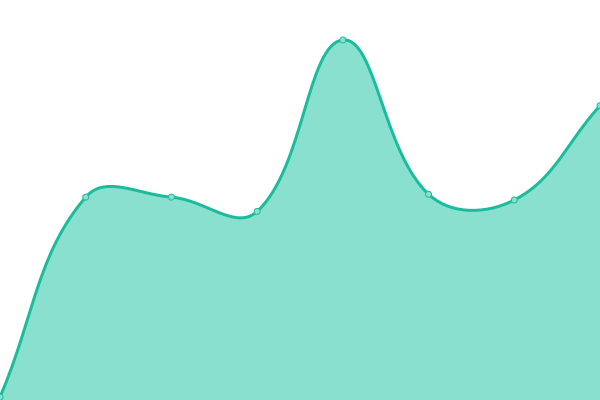
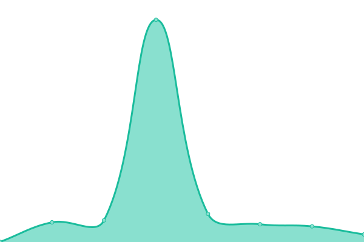

# [📈 Live Status](https://status.d.foundation): <!--live status--> **🟧 Partial outage**

This repository contains the open-source uptime monitor and status page for [Dwarves Foundation](https://dwarves.foundation), powered by [Upptime](https://github.com/upptime/upptime).

With [Upptime](https://upptime.js.org), you can get your own unlimited and free uptime monitor and status page, powered entirely by a GitHub repository. We use [Issues](https://github.com/dwarvesf/upptime/issues) as incident reports, [Actions](https://github.com/dwarvesf/upptime/actions) as uptime monitors, and [Pages](https://status.d.foundation) for the status page.

<!--start: status pages-->
<!-- This summary is generated by Upptime (https://github.com/upptime/upptime) -->
<!-- Do not edit this manually, your changes will be overwritten -->
<!-- prettier-ignore -->
| URL | Status | History | Response Time | Uptime |
| --- | ------ | ------- | ------------- | ------ |
|  Fortress API | 🟩 Up | [fortress-api.yml](https://github.com/dwarvesf/upptime/commits/HEAD/history/fortress-api.yml) | 

 197ms
     
 | 

<a href="https://status.d.foundation/history/fortress-api">100.00%</a>
    

|  IR API | 🟥 Down | [ir-api.yml](https://github.com/dwarvesf/upptime/commits/HEAD/history/ir-api.yml) | 

 125ms
     
 | 

<a href="https://status.d.foundation/history/ir-api">0.00%</a>
    

|  ICY swap API | 🟩 Up | [icy-swap-api.yml](https://github.com/dwarvesf/upptime/commits/HEAD/history/icy-swap-api.yml) | 

 105ms
     
 | 

<a href="https://status.d.foundation/history/icy-swap-api">100.00%</a>
    

|  Brainery API | 🟩 Up | [brainery-api.yml](https://github.com/dwarvesf/upptime/commits/HEAD/history/brainery-api.yml) | 

 643ms
     
 | 

<a href="https://status.d.foundation/history/brainery-api">100.00%</a>
    

|  CGit | 🟥 Down | [c-git.yml](https://github.com/dwarvesf/upptime/commits/HEAD/history/c-git.yml) | 

 129ms
     
 | 

<a href="https://status.d.foundation/history/c-git">0.00%</a>
    

|  Deepwiki | 🟥 Down | [deepwiki.yml](https://github.com/dwarvesf/upptime/commits/HEAD/history/deepwiki.yml) | 

 98ms
     
 | 

<a href="https://status.d.foundation/history/deepwiki">0.00%</a>
    

|  Vault | 🟩 Up | [vault.yml](https://github.com/dwarvesf/upptime/commits/HEAD/history/vault.yml) | 

 121ms
     
 | 

<a href="https://status.d.foundation/history/vault">99.63%</a>
    

<!--end: status pages-->

[**Visit our status website →**](https://status.d.foundation)

## 📄 License

- Powered by: [Upptime](https://github.com/upptime/upptime)
- Code: [MIT](./LICENSE) © [Anand Chowdhary](https://anandchowdhary.com), supported by [Pabio](https://pabio.com)
- Data in the `./history` directory: [Open Database License](https://opendatacommons.org/licenses/odbl/1-0/)
